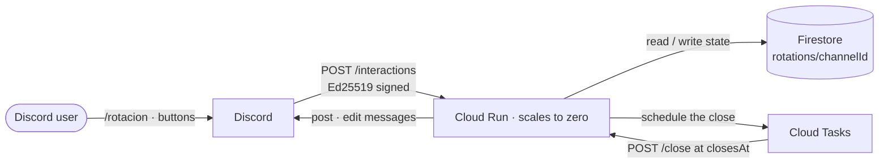

<p align="center">
  
</p>

<h1 align="center">lilibot</h1>

<p align="center">
  A Discord bot that shares out the seats in a game group capped at <strong>5 players</strong>.<br>
  Runs on Google Cloud Run for <strong>$0/month</strong>.
</p>

---

## What it does

Opens a sign-up, people join with a button, and when it closes it draws at random who sits
out — remembering last round's leftovers so the same people don't always miss out.

- `/rotacion` posts a sign-up with **Apuntarme**, **Salir** and **Cerrar convocatoria**
- Each person counts once, however many times they click
- It closes on a timer or on the button, whichever comes first
- **5 or fewer** signed up → everybody plays, no rotation
- **More than 5** → the excess are drawn at random, but anyone benched last round has a
  **guaranteed seat** and is not entered into the draw
- This round's nominees are next round's immune players — that handover is the whole rotation

Memory is per channel. The full rules, including what happens when more than five players are
owed a seat, are in [the architecture guide](docs/architecture.md#data-model).

## Architecture



There is no gateway and no WebSocket — Discord calls the bot, not the other way round. Nothing
stays running between sign-ups, which is what makes it free, and also why joining is a button
rather than a reaction: reactions are gateway-only events.

**Zero runtime dependencies.** Node 24's WebCrypto covers Ed25519, `fetch` covers the rest, and
type stripping means no build step. Boot is **~85 ms**, against Discord's 3-second response
deadline. The reasoning is in [Architecture](docs/architecture.md), along with [how to add a feature](docs/architecture.md#adding-a-feature).

## Commands

| Command | What it does |
|---|---|
| `pnpm test` | The full suite, 70 tests |
| `pnpm typecheck` | `tsc --noEmit` |
| `pnpm dev` | Runs the server with `--watch`, reading `.env` |
| `pnpm commands` | Registers the `/rotacion` slash command with Discord |
| `./deploy/provision.sh` | Creates the GCP infrastructure, once |
| `./deploy/deploy.sh` | Builds and deploys to Cloud Run |

## Configuration

Copy `env.example` to `.env` for local work. In production Cloud Run injects these: the two
secrets from Secret Manager, the rest as plain variables.

| Variable | Required | Default | What it is |
|---|---|---|---|
| `DISCORD_TOKEN` | yes | — | Bot token (**secret**) |
| `DISCORD_PUBLIC_KEY` | yes | — | Public key used to verify signatures |
| `APPLICATION_ID` | yes | — | Discord application ID |
| `GUILD_ID` | no | global | Server to register the command in |
| `GCP_PROJECT` | yes | — | Project ID (`GOOGLE_CLOUD_PROJECT` also works) |
| `SERVICE_URL` | yes | — | The service's public URL; Cloud Tasks calls `${SERVICE_URL}/close` |
| `TASKS_LOCATION` | no | `us-east1` | Queue region |
| `TASKS_QUEUE` | no | `lilibot-close` | Queue name |
| `PORT` | no | `8080` | Listening port |

Where each key comes from is in [Discord setup](docs/discord-setup.md#step-2--the-keys-you-need).

## Documentation

| Guide | What's in it |
|---|---|
| [Discord setup](docs/discord-setup.md) | Creating the application, the keys you need, inviting the bot, connecting the endpoint |
| [Deployment](docs/deployment.md) | Provisioning and deploying to GCP, automatic deploys, cost, uninstalling |
| [Architecture](docs/architecture.md) | How it works and why: the interactions model, data model, security, project layout |
| [Development](docs/development.md) | Running the tests, working locally, where to change what |
| [Troubleshooting](docs/troubleshooting.md) | Symptoms, causes, and how to inspect a running deployment |
| [PRDs](docs/prd/) | Decision records: both versions of the bot, and the extensible core |

## Quick start

```bash
pnpm install
PROJECT_ID=your-project ./deploy/provision.sh
PROJECT_ID=your-project APPLICATION_ID=123456789 ./deploy/deploy.sh
```

Then paste `https://YOUR-SERVICE.run.app/interactions` into the Developer Portal's Interactions
Endpoint URL and run `pnpm commands`. Full walkthrough in
[Discord setup](docs/discord-setup.md).

> Cloud Run's free tier exists only in `us-central1`, `us-east1` and `us-west1`. The deploy
> scripts refuse any other region so a misconfigured deploy cannot bill silently.
