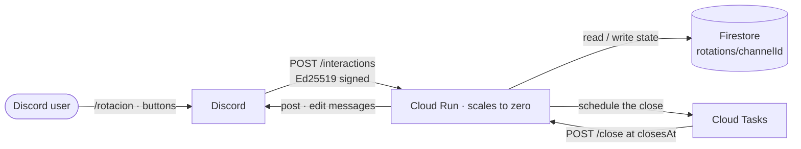
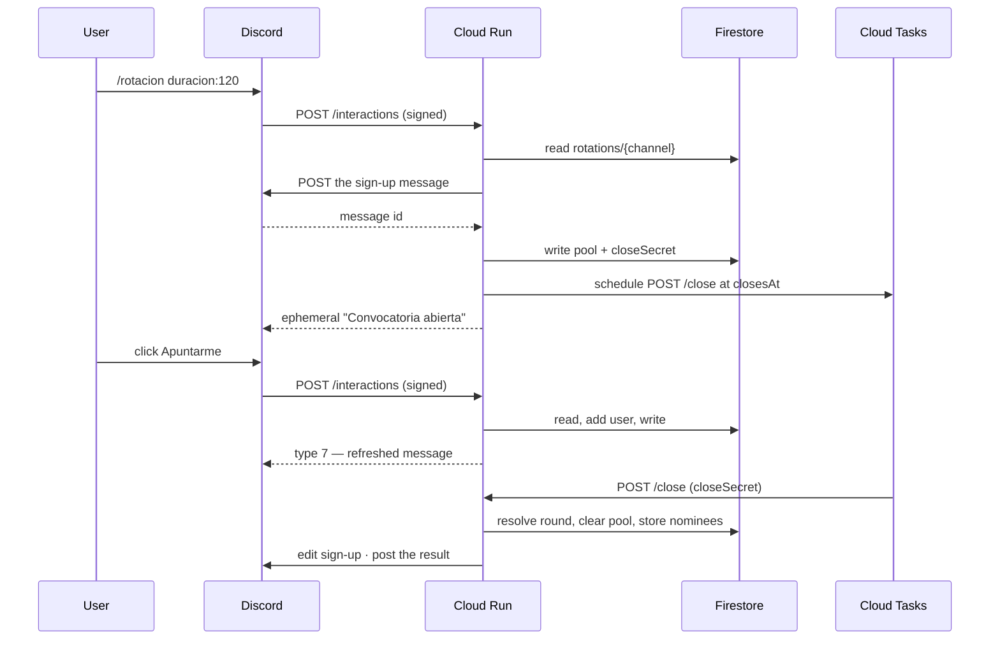

[← Back to the README](../README.md)

# Architecture

How the bot is put together, and why. The short version: it is a stateless HTTP handler that
Discord calls, with all state in Firestore and all delayed work in Cloud Tasks.

---

## Overview



There is no gateway and no WebSocket: **Discord calls the bot, not the other way round.** No
process stays up, so there is nothing to pay for between sign-ups.

---

## Why HTTP interactions

A Discord bot can receive events two ways.

| | Gateway | HTTP interactions |
|---|---|---|
| Connection | The bot holds a WebSocket open 24/7 | Discord POSTs to a URL |
| Hosting | Needs an always-on process | Can scale to zero |
| Cost on GCP | VM + public IPv4 = **$3.65/month** | **$0** inside the free tier |
| Receives reactions | Yes | **No** |
| Receives slash commands and buttons | Yes | Yes |

The two are **mutually exclusive per application**: setting an Interactions Endpoint URL stops
the gateway delivering events. And reactions are gateway-only.

That is the whole reason signing up is a button rather than a reaction. It was not a design
preference — it is what the platform allows for a bot that costs nothing to host.

The trade is not all loss:

| | Reactions (the old design) | Buttons |
|---|---|---|
| Joining | Any emoji, informal | One click |
| Counting unique people | Set plus a re-sweep of all reactions at close | The `user_id` arrives in the payload |
| Leaving | Remove *all* your reactions | An explicit **Salir** button |
| Gateway intents needed | `GuildMessageReactions` + four partials | None |

The alternatives that were rejected: **App Engine Standard** is free but does not support
background processes, and **App Engine Flexible** supports them but has no free tier at all.

---

## Why zero runtime dependencies

`package.json` has **no `dependencies` block**. Not `discord.js`, not the Google SDKs.

Discord requires an initial response within **3 seconds**, and a scaled-to-zero service pays a
cold start on the first interaction after a quiet period. Every dependency is bytes to pull and
modules to evaluate before the first byte of the response.

What replaced them:

| Would have been | Is instead |
|---|---|
| `discord.js` for embeds and buttons | Plain JSON in `src/features/rotation/render.ts` |
| `discord.js` REST client | `fetch` in `src/discord/rest.ts` |
| `discord-interactions` for signatures | Node 24 WebCrypto Ed25519 in `src/discord/verify.ts` |
| `@google-cloud/firestore` | Firestore REST in `src/gcp/firestore.ts` |
| `@google-cloud/tasks` | Cloud Tasks REST in `src/gcp/tasks.ts` |
| A service-account key file | Access token from the metadata server, `src/gcp/auth.ts` |

Node 24 also strips TypeScript types at load, so there is no build step either. The container
is the base image plus `src/`.

**Measured boot: ~85 ms** from process start to first HTTP response, against a 3-second budget.

---

## The lifecycle of a round



### Why the bot posts the sign-up message itself

Cloud Run only guarantees CPU **while a request is in flight**. Nothing can be deferred to
after the response is sent, so every handler finishes its work and responds last.

That rules out "reply with the message, then look it up": the message id is needed in the
document, and only `POST /channels/{id}/messages` returns it. Posting it directly also means
the close path edits with the **bot token**, which sidesteps the 15-minute interaction-token
expiry — so a sign-up can run for hours.

### Two ways to close, one commit

`commitClose()` in `src/features/rotation/close.ts` resolves the round and writes it, without touching
Discord. The caller renders the outcome, because the two paths differ:

- **The button** can piggyback on the interaction response (`type 7` edits the message it is
  attached to), saving a REST round trip.
- **The Cloud Tasks callback** has no interaction, so it edits over REST.

Committing before announcing is deliberate: the document is the source of truth, and closing it
first is what stops a button press and the scheduled task both resolving the same round.

Closing early leaves the scheduled task pending. When it fires it finds `pool === null`,
returns 200 and does nothing — cheaper than deleting the task.

---

## Data model

One Firestore document per channel, at `rotations/{channelId}`:

```ts
{
  immune: string[],          // benched last round — the rotation memory
  lastRoundAt: string,
  pool: null | {             // the open sign-up, null when none
    messageId, hostId, note, closesAt,
    participants: string[],
    closeSecret: string,     // single-use, authenticates the Cloud Tasks callback
  }
}
```

`benched` becoming the next round's `immune` is the entire rotation — one assignment in
`commitClose()`. An empty list (five players or fewer) clears the debt, which is correct: if
nobody sat out, nobody is owed a seat.

An **empty sign-up does not clear the memory**: nobody played, so nobody paid their turn off.

### Concurrency

Two people clicking at the same instant is the realistic collision. Writes use an optimistic
`currentDocument.updateTime` precondition plus a bounded retry from a fresh read
(`src/core/store.ts`) — simpler than Firestore transactions and sufficient for a document
only one channel ever touches.

---

## Security model

The Cloud Run service **must** accept unauthenticated requests, because Discord does not
authenticate. So IAM cannot be the gate, and everything rests on signatures.

- **Every request to `/interactions` is verified with Ed25519** over `timestamp + rawBody`,
  before the payload is parsed. Invalid or missing signature → `401`. The body is read as raw
  bytes; reserialising parsed JSON would change them and break every signature.
- **`/close` is authenticated by `closeSecret`**, a single-use random value written into the
  pool document when it was opened and compared in constant time. A stale or forged task is a
  200 no-op.
- **The service account holds three roles**, scoped to the two secrets, Firestore, and
  enqueueing tasks. Not the default Compute service account.
- **The bot token never reaches the repository.** It goes from your terminal into Secret
  Manager and from there into the process environment.
- **No privileged gateway intents.** The bot cannot read message content, and does not ask to.

---

## Project layout

```
src/
  core/                    infrastructure that knows nothing about any feature
    registry.ts            routes commands and components to whoever declared them
    store.ts               createDocumentStore<T>: optimistic concurrency, any shape
    http.ts                request and response shapes
    memory.ts              in-memory Firestore for the tests
  discord/                 the protocol, and nothing about this bot
    types.ts  constants.ts  verify.ts  rest.ts  responses.ts  interaction.ts
  gcp/                     auth.ts  firestore.ts  tasks.ts
  features/
    index.ts               the list of features the bot has
    rotation/
      index.ts             what this feature answers to
      command.ts           /rotacion: its definition and its handler, together
      buttons.ts           the component handlers
      ids.ts               the custom_id namespace this feature owns
      close.ts             committing a round, and the Cloud Tasks callback
      render.ts            embeds and buttons as JSON
      state.ts             the document shape and its store
      rotation.ts          the draw rule: randomness and immunity. No I/O
      pool.ts              joining and leaving a sign-up. No I/O
      deps.ts              what this feature needs from the outside world
  deps.ts                  what the application provides
  server.ts                signature check, then dispatch through the registry
  index.ts                 HTTP server and composition root
  deploy-commands.ts       registers whatever the features declare
```

The dependency direction is one-way: `core/` and `discord/` and `gcp/` know nothing about
`features/`, and features know nothing about each other. Inside a feature, `rotation.ts` and
`pool.ts` are pure — no Discord, no Google, no I/O at all.

That is why the rewrite from gateway to serverless changed every file **except**
`rotation.ts` and its tests. The rules that actually matter never moved.

## Adding a feature

Everything a feature needs to declare lives in its own folder:

```ts
// src/features/stats/index.ts
export const statsFeature: Feature<StatsDeps> = {
  name: 'stats',
  commands: [statsCommand],                              // { definition, handle }
  components: [{ prefix: 'stats:', handle: handleButton }],
};
```

then one line in `src/features/index.ts`. `server.ts`, `index.ts` and `deploy-commands.ts`
are untouched: the registry routes by command name and by `custom_id` prefix, and
`deploy-commands.ts` registers whatever `definitions()` returns.

Two mistakes fail at boot rather than in production: two features claiming the same command
name, and two features claiming overlapping `custom_id` prefixes. `createRegistry` throws on
both.

State is the same story — `createDocumentStore<T>(firestore, 'stats', normalise)` gives a new
feature its own collection with the same optimistic-concurrency handling, without copying it.

The one thing still tied to a single feature is the `/close` route in `server.ts`. When a
second feature needs delayed work, that becomes a task registry the same way commands did.

---

## Platform constraints worth remembering

| Constraint | Consequence |
|---|---|
| 3-second initial response | No dependencies; everything the handler needs is a round trip or two |
| No CPU after the response | Handlers finish their work *before* responding |
| Interaction token expires in 15 min | Long sign-ups are edited with the bot token, not the webhook |
| Instances are ephemeral and parallel | No in-memory state; Firestore holds everything |
| No timers in a scaled-to-zero service | The delayed close is a Cloud Tasks task |
| Cloud Run free tier is US-only | `us-east1`, enforced by the deploy scripts |

---

**Next:** [Development](development.md) · [Deployment](deployment.md) ·
[PRDs](prd/) for the decision records
